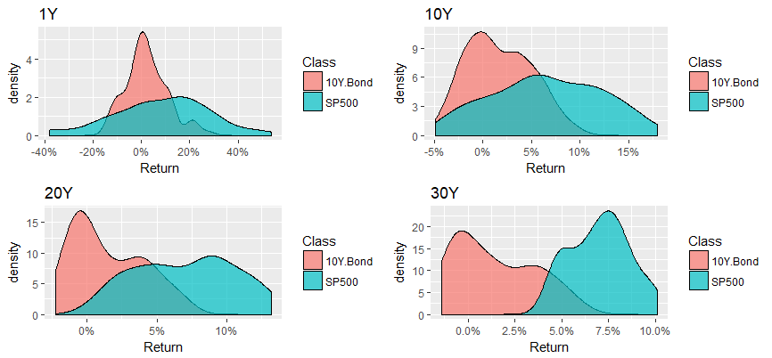
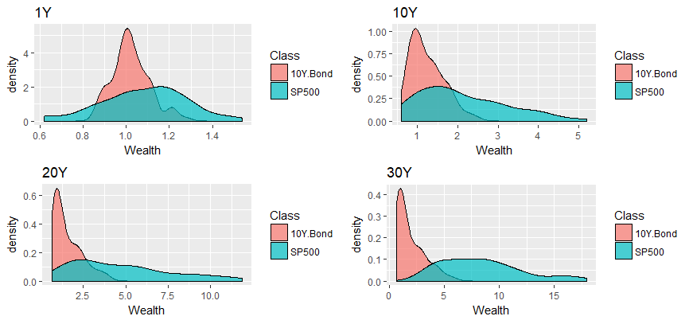
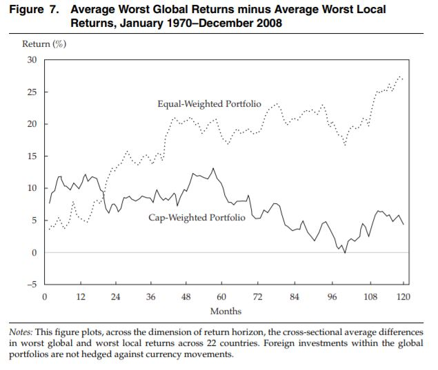

* [Risky assets](#risky-assets-stocks-vs-bonds)
* [Global diversification](#global-diversification)
* [Volatility drag and diversification return](#volatility-drag-and-diversification-return-am-gm-and-the-central-limit-theorem)

### Risky assets: stocks vs. bonds

Historically, equity returns have dominated bond returns over reasonable time scales, not only performing better in the best cases but also in the worst cases, despite greater volatility.

We can also view the differences in terms of final wealth:

### Global diversification

Asness, Israelov and Liew (2011) compare drawdowns for local portfolios (invested entirely in the local stock market) to unhedged globally diversified portfolios (either weighting the countries equally or using cap weighting) based on a universe of 22 developed countries.

Over the short term (up to about 24 months), the worst case returns for the global portfolios are on average similar to/slightly better than those of the local portfolios. The difference increases with time for the equal-weighted global portfolio but not for the cap-weighted one, suggesting that global diversification can reduce risk over reasonable time scales, even in the absence of hedging, but that cap-weighted indices do not provide sufficient diversification. (Alternatively, the equal-weighted portfolios may have a value tilt compared to the cap-weighted portfolios.)

The authors break returns down into multiple expansion and economic performance (measured by dividends and dividend growth). While multiple expansion dominates in the short run, country-specific economic performance has a greater impact over longer periods.

* Asness, C.S., Israelov, R. and Liew, J.M., 2011. International diversification works (eventually). Financial Analysts Journal, 67(3), pp.24-38. ([https://www.cfapubs.org/doi/pdf/10.2469/faj.v67.n3.1](https://www.cfapubs.org/doi/pdf/10.2469/faj.v67.n3.1))

### Volatility drag and diversification return: AM-GM and the central limit theorem

Volatility drag: The difference between arithmetic and geometric returns.

Diversification return: The difference between the (geometric) return of the portfolio and the weighted (geometric) return of its components.

Presumably we care about final wealth rather than the (geometric) growth rate of wealth. As losses are capped at 100% and gains are effectively unbounded, stock returns are positively skewed. It turns out that they (*very*) roughly follow a log-normal distribution. For a log-normal distribution, the median is equal to the geometric mean. In particular, it is less than the arithmetic mean, so the typical final wealth is less than the expected final wealth. By averaging multiple (ideally independent, or even negatively dependent) log-normal random variables, we increase the probability of including a large positive return, improving the median outcome.
